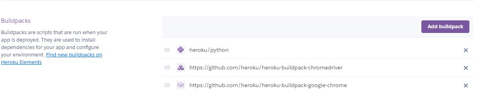

# Journey Planner - Telegram Chatbot

- Assist user by providing the exact time to leave their house to board their desired bus on time.
- Send location to the bot and the bot will reply with nearby bus stops.
- Built with Telegram API, Google Map API, LTA DataMall API

## Screenshot
Short Video that demostrates the use of this chat bot application. 

### 1. Location A to Location B


## How to setup

### 1. Clone this repository
```bash
git clone https://github.com/kelvinngsl/journey-planner-telegram-bot.git
```

### 2. Open up app.py and Replace <TOKEN> & <HEROKU_URL> with your own Telegram Bot Token and Heroku URL
### 3. Push to Heroku
### 4. Add the following Heroku Buildpack for Selenium to work

### 5. Enjoy your Bot!
```
Dhoby Ghaut to Nex
```

## Built With

* Backend
  * [python-telegram-bot](https://github.com/python-telegram-bot/python-telegram-bot)
  * [Gunicorn](https://gunicorn.org/)
  * [Selenium](https://selenium-python.readthedocs.io/)

* Deployment
  * Heroku

* Data
  * [gothere.sg](gothere.sg)


## Authors

 **Kelvin** - [kelvinngsl](https://github.com/kelvinngsl)
